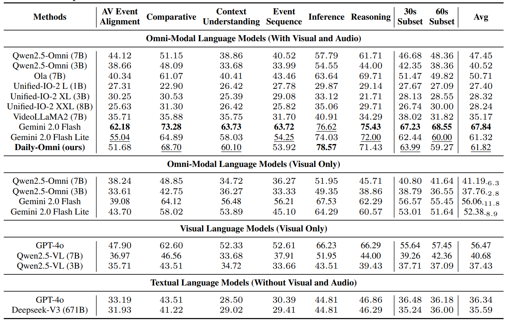

# Daily-Omni: Towards Audio-Visual Reasoning with Temporal Alignment across Modalities

This is the official repository of Daily-Omni


## Requirements

To install requirements:

```setup
pip install -r requirements.txt
```

To test our benchmark, you should download `Videos.tar` and 'qa.json' from [Huggingface](https://huggingface.co/datasets/liarliar/Daily-Omni/tree/main) to this directory and extract the `Videos/` folder and `qa.json` to this directory.
## QA Generation


>📋 We provide script to reproduce our Daily-Omni QA Generation pipeline. Run the following command to generate QA pairs.
To run the script, first you should revise the `config.py` file to set the parameters:
- Set the api keys, base_urls and model_name. You can create api keys from the following links: [Gemini](https://aistudio.google.com/apikey), [OpenAI](https://platform.openai.com/account/api-keys), [Deepseek](https://platform.deepseek.com/api_keys), [Aliyun](https://bailian.console.aliyun.com/?tab=model#/api-key)

- Set `BASE_DIR` and `CSV_PATH` to the Video Folder you want to annotate and the path to the csv file that records the videos. You can use `example_videos` and `example_metadata.csv` as templetes.

- Set `MAX_WORKERS_PROCESSES` to the number of processes you want to use to run the pipeline. You can set `execution_mode` in `run_pipeline.py` to choose the execution mode if your api key has parallel requests limitation.

- Set `run_pipeline_flags` in `run_pipeline.py` to choose which part of the pipeline you want to run.

Test the pipeline with:
```train
python run_pipeline.py
```

## Test Daily-Omni

### Model with api
>📋To test the benchmark on third party models(Gemini, GPT-4o, Deepseek) with api and reproduce the results, you can use the script provided in `test_model_api/`

```eval
python test_model_api/test_model.py --model <model_name> --mode <Execution_mode> --max_items <Maximum number of QA items to process (for testing)>
```
You can check the model options in `test_model_api/test_config.py`
### Model running locally
>📋To test the benchmark on third party models(Qwen2.5-Omni, Qwen2.5-VL, VideoLLaMA2, Ola, Unified-IO 2) with local machines, check the code in `test_model/`

#### Qwen2.5-Omni
You should install the dependencies with instructions from the [official Qwen2.5-Omni repo](https://github.com/QwenLM/Qwen2.5-Omni)

Run the test script with the following command:
```python
python test_model/Qwen2.5-Omni/testmodel.py --video_base_dir VIDEO_BASE_DIR --json_file_path JSON_FILE_PATH --model_name_or_path MODEL_NAME_OR_PATH --processor_name_or_path PROCESSOR_NAME_OR_PATH --use_audio_in_video --disable_audio_output
```
You can test Qwen2.5-Omni's performance without audio by removing `--use_audio_in_video` flag.
#### Qwen2.5-VL
You should install the dependencies with instructions from the [official Qwen2.5-VL repo](https://github.com/QwenLM/Qwen2.5-VL)

Run the test script with the following command:
```python
python test_model/Qwen2.5-VL/testmodel.py --video_base_dir VIDEO_BASE_DIR --json_file_path JSON_FILE_PATH --model_name_or_path MODEL_NAME_OR_PATH --processor_name_or_path PROCESSOR_NAME_OR_PATH
```
####  VideoLLaMA2
You should install the dependencies with instructions from the [official VideoLLaMA2 repo](https://github.com/DAMO-NLP-SG/VideoLLaMA2)

Run the test script with the following command:
```python 
python test_model/VideoLLaMA2-av/testmodel.py --video_base_dir VIDEO_BASE_DIR --json_file_path JSON_FILE_PATH
```
#### Unified-IO 2
You should install the dependencies with instructions from the [official Unified-IO 2 repo](https://github.com/allenai/unified-io-2.pytorch)

Run the test script with the following command:
```python 
python test_model/unified-io-2.pytorch/testmodel.py --video_base_dir VIDEO_BASE_DIR --json_file_path JSON_FILE_PATH --model MODEL_NAME
```
#### Ola
You should install the dependencies with instructions from the [official Ola repo](https://github.com/Ola-Omni/Ola)

Run the test script with the following command:
```python 
python test_model/Ola/inference/testmodel.py VIDEO_BASE_DIR --json_file_path JSON_FILE_PATH
```

## Test Daily-Omni Agent
.png)
> We provide a script to test Daily-Omni Agent on Daily-Omni benchmark.
For efficiency, we used the API provided by Bailian Aliyun for Qwen2.5-VL and Qwen2.5, while Qwen2-Audio was deployed locally. According to the [official documentation](https://help.aliyun.com/zh/model-studio/model-user-guide/), qwen2.5-vl-7b-instruct and qwen2.5-14b-instruct provided by Bailian Aliyun are identical to their open-source counterparts. Our code implements direct passing of local_video_path to the Qwen2.5-VL API. **However, this functionality might require you to contact Aliyun customer service to enable.** If direct path input is not activated, you can alternatively pass a list of video frames, though this may result in suboptimal performance.

To run the agent, you need to setup a new environment for Qwen2-Audio according to the instructions in the [official repository](https://github.com/QwenLM/Qwen2-Audio).

Then, launch the Qwen2-Audio server locally with running:
```python
python baseline/qwen_audio.py
```
Segment the video and audio clips:
```python
python baseline/segment_av.py
```

Run Daily-Omni Agent on Daily-Omni benchmark with the following command:

```python 
python baseline/base_model.py
```
This script will automatically evaluate the performance of the model on the Daily-Omni benchmark.

## Results




